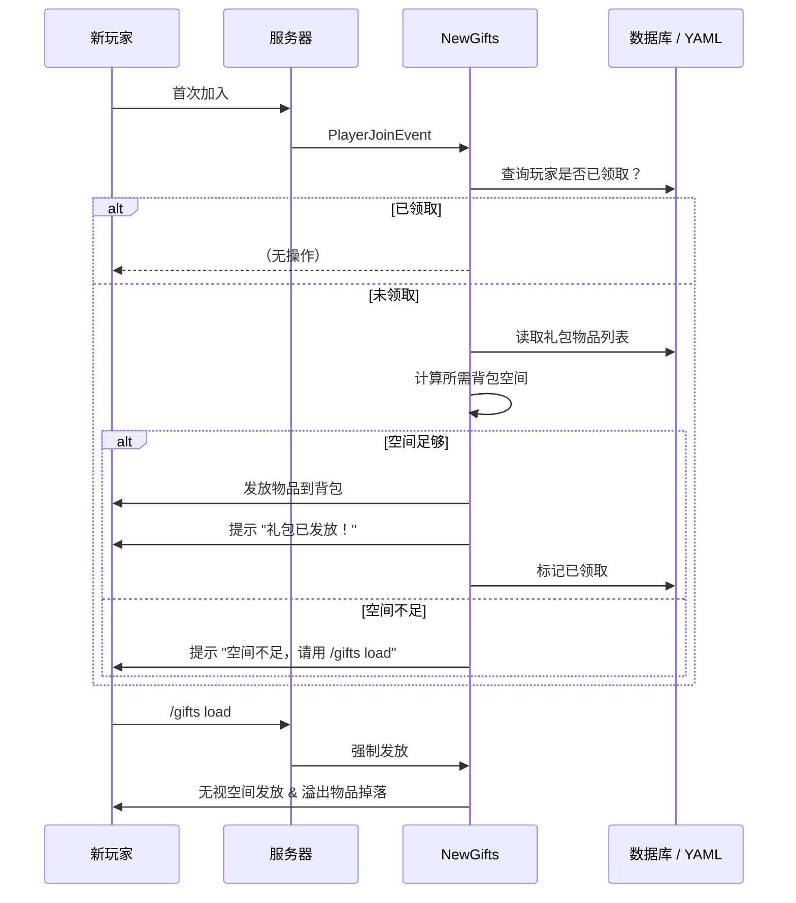

# 🎁 NewGifts — Minecraft 新手礼包插件

面向 **Purpur 1.21.11**（及未来版本）的 Minecraft 新手礼包自动发放插件，支持 YAML 配置文件和数据库两种存储方式。数据库模式下可通过可视化 GUI 编辑礼包内容，完整保留物品 NBT 数据。

---

## 目录

- [功能特性](#功能特性)
- [环境要求](#环境要求)
- [安装](#安装)
- [配置文件](#配置文件)
  - [config.yml — 主配置](#configyml--主配置)
  - [gifts.yml — 礼包物品（YAML 模式）](#giftsyml--礼包物品yaml-模式)
- [存储模式](#存储模式)
  - [YAML 配置文件模式](#yaml-配置文件模式)
  - [数据库模式](#数据库模式)
- [命令](#命令)
- [权限](#权限)
- [物品配置字段说明](#物品配置字段说明)
- [数据库表结构](#数据库表结构)
- [工作流程](#工作流程)
- [消息自定义](#消息自定义)
- [开发者 / 构建](#开发者--构建)
- [常见问题](#常见问题)

---

## 功能特性

- ✅ **双存储模式** — YAML 配置文件存储 或 SQLite / MySQL 数据库存储，一键切换
- ✅ **可视化 GUI 编辑** — 数据库模式下，OP 可通过 3×9 箱子面板拖拽物品编辑礼包
- ✅ **完整 NBT 保留** — 数据库模式使用 Paper 原生 `serializeAsBytes()`，确保附魔、Lore、自定义模型数据等不丢失
- ✅ **YAML 友好格式** — 支持手写 `type` / `amount` / `name` / `lore` / `enchantments` / `flags` / `custom-model-data` / `unbreakable`
- ✅ **智能背包检测** — 玩家首次加入时检测背包空间，空间不足则暂不发放
- ✅ **强制领取命令** — `/gifts load` 无视背包空间直接发放，溢出物品掉落地面
- ✅ **玩家时间重置** — `/gifts reload time` 重置所有玩家的领取记录
- ✅ **可堆叠物品** — 支持最大 64 个堆叠，背包已有同类物品时自动合并
- ✅ **27 格容量** — 礼包最多 27 种不同物品（3×9 箱子一页）

---

## 环境要求

| 项目 | 版本 |
|------|------|
| 服务端 | Purpur **1.21.11** 或更高 |
| Java | **21** LTS |
| 构建工具 | Maven 3.9+ |

---

## 安装

1. 从 [Releases](https://github.com/ahhhub/newgifts/releases) 下载最新版本 `NewGifts-1.0.0.jar`
2. 将 JAR 放入服务器 `plugins/` 目录
3. 重启服务器（或使用 `/reload confirm`）
4. 编辑 `plugins/NewGifts/config.yml` 调整存储方式和消息
5. 如使用 YAML 模式，编辑 `plugins/NewGifts/gifts.yml` 配置礼包物品
6. 执行 `/gifts reload` 使配置生效

---

## 配置文件

### config.yml — 主配置

插件首次加载时自动生成，位于 `plugins/NewGifts/config.yml`：

```yaml
# 存储方式: yaml (配置文件) 或 database (数据库)
storage:
  type: database          # 默认数据库模式，可使用 GUI 编辑

database:
  type: sqlite            # sqlite 或 mysql

  mysql:
    host: localhost
    port: 3306
    database: minecraft
    username: root
    password: ""

  sqlite:
    file: gifts.db        # 数据库文件位于 plugins/NewGifts/

messages:
  prefix: "&8[&6新手礼包&8] &r"
  first-join-gift: "&a欢迎来到服务器！新手礼包已发放到您的背包！"
  first-join-full: "&c您的背包空间不足，新手礼包未能发放！请清理背包后使用 &e/gifts load &c重新领取。"
  gift-load-success: "&a新手礼包已成功发放！"
  gift-load-fail: "&c发放失败，部分物品可能无法放入背包，请检查背包空间。"
  gift-no-items: "&c当前没有配置新手礼包物品，请联系管理员。"
  gui-unavailable: "&c打开面板失败，当前采用配置文件存储数据，如需使用GUI，请调整存储方式为数据库。"
  gui-title: "新手礼包编辑"
  no-permission: "&c你没有权限使用此命令！"
  reload-success: "&a配置已重新加载！共计 &e{count} &a件物品。"
  reload-time-success: "&a所有玩家的游玩时间已重置，重新进入服务器即可领取新手礼包。"
  player-only: "&c该命令只能由玩家执行！"
  unknown-command: "&c未知子命令，请使用 /gifts gui|reload|load"
```

| 配置项 | 说明 |
|--------|------|
| `storage.type` | `yaml` = 从 gifts.yml 读取；`database` = 从数据库读取 |
| `database.type` | `sqlite` 或 `mysql` |
| `database.sqlite.file` | SQLite 数据库文件名 |
| `database.mysql.*` | MySQL 连接参数（host / port / database / username / password） |
| `messages.*` | 所有提示消息，支持 `&` 颜色代码和 `{count}` 占位符 |

### gifts.yml — 礼包物品（YAML 模式）

仅当 `storage.type: yaml` 时生效，位于 `plugins/NewGifts/gifts.yml`：

```yaml
gifts:
  '1':
    type: DIAMOND_SWORD
    amount: 1
    name: '&6新手之剑'
    lore:
      - '&7一把陪伴你起步的宝剑'
    enchantments:
      SHARPNESS: 3
      UNBREAKING: 2
    flags:
      - HIDE_ENCHANTS
    unbreakable: true

  '2':
    type: DIAMOND_PICKAXE
    amount: 1
    name: '&6新手之镐'
    enchantments:
      EFFICIENCY: 3
      UNBREAKING: 2

  '3':
    type: BREAD
    amount: 32
```

> **编号规则**：键名 `'1'` `'2'` ... `'27'`，按数字升序发放。编号不连续不影响，最多读取 27 个，多余的自动忽略。

---

## 存储模式

### YAML 配置文件模式

```yaml
storage:
  type: yaml
```

| 优点 | 缺点 |
|------|------|
| 纯文本编辑，无需数据库 | 复杂 NBT 物品无法配置 |
| 适合简单礼包 | 不支持 GUI 可视化编辑 |
| 修改后 `/gifts reload` 即生效 | 不支持 `/gifts gui` |

### 数据库模式

```yaml
storage:
  type: database
```

| 优点 | 缺点 |
|------|------|
| GUI 可视化拖拽编辑 | 需要数据库环境（SQLite 零配置） |
| 完整保留所有 NBT 数据 | 物品迁移需导出导入 |
| 支持附魔书、药水、烟花等复杂物品 | — |

**切换模式后需执行 `/gifts reload` 使配置生效。**

---

## 命令

| 命令 | 说明 | 权限 |
|------|------|------|
| `/gifts` | 查看帮助 | 所有人 |
| `/gifts gui` | 打开礼包编辑面板（仅数据库模式） | OP |
| `/gifts reload` | 重载配置和礼包数据 | OP |
| `/gifts reload time` | 重置所有玩家为"新玩家"状态 | OP |
| `/gifts load` | 强制领取礼包（无视背包空间） | 所有人 |

### 命令详细说明

#### `/gifts gui`
- 打开一个 **3×9（27 格）箱子界面**，标题为 `新手礼包编辑`
- 可将背包中的物品 **拖入 / 取出** 箱子来编辑礼包内容
- **关闭界面时自动保存** 到数据库（异步写入，不卡顿）
- 物品的 NBT 数据（附魔、名称、Lore、自定义模型等）完整保留
- ⚠️ 仅数据库模式下可用，YAML 模式下会提示错误

#### `/gifts reload`
- 重新加载 `config.yml` 和 `gifts.yml`（或重新连接数据库）
- 修改配置文件或数据库内容后执行此命令生效
- 控制台输出当前礼包物品数量

#### `/gifts reload time`
- 清除所有玩家在 `players.yml` 中的领取记录
- 所有玩家下次加入时将被视为"新玩家"并尝试发放礼包
- ⚠️ **不可逆操作**，建议执行前备份 `players.yml`

#### `/gifts load`
- 强制领取礼包，**无视背包剩余空间**
- 放不下的物品会掉落在玩家脚下
- 适用于首次加入时背包已满、后续清理后手动领取的场景

---

## 权限

```yaml
permissions:
  gifts.command:              # 使用 /gifts 命令（所有人默认拥有）
    default: true

  gifts.command.gui:          # 打开 GUI 编辑面板
    default: op

  gifts.command.reload:       # 重载配置
    default: op

  gifts.command.reload.time:  # 重置玩家时间
    default: op

  gifts.command.load:         # 强制领取礼包
    default: true
```

---

## 物品配置字段说明

以下字段在 `gifts.yml`（YAML 模式）中可用：

| 字段 | 类型 | 必填 | 说明 | 示例 |
|------|------|------|------|------|
| `type` | String | ✅ | 物品材质 ID | `DIAMOND_SWORD`、`BREAD` |
| `amount` | Integer | ❌ | 物品数量（默认 1，最大 64） | `32` |
| `name` | String | ❌ | 物品显示名称，支持 `&` 颜色代码 | `'&6神剑'` |
| `lore` | List | ❌ | 物品描述，每行一个，支持 `&` 颜色代码 | `- '&7第一行'` |
| `enchantments` | Map | ❌ | 附魔，格式 `附魔名: 等级` | `SHARPNESS: 5` |
| `flags` | List | ❌ | 物品标识（隐藏附魔等） | `- HIDE_ENCHANTS` |
| `custom-model-data` | Integer | ❌ | 自定义模型数据 | `12345` |
| `unbreakable` | Boolean | ❌ | 是否不可破坏 | `true` |

### 支持的附魔名

附魔名需使用 Bukkit 标准名称，与 `/enchant` 命令一致：
`SHARPNESS`、`EFFICIENCY`、`UNBREAKING`、`FORTUNE`、`SILK_TOUCH`、`PROTECTION`、`MENDING`、`FIRE_ASPECT` 等。

### 支持的 ItemFlag

`HIDE_ENCHANTS`、`HIDE_ATTRIBUTES`、`HIDE_UNBREAKABLE`、`HIDE_DESTROYS`、`HIDE_PLACED_ON`、`HIDE_DYE` 等。

### 颜色代码

所有文本字段支持 `&` 颜色代码：`&0`~`&f`、`&k`~`&r`、`&l`、`&m`、`&n`、`&o`。

---

## 数据库表结构

### SQLite / MySQL

```sql
-- SQLite
CREATE TABLE IF NOT EXISTS gifts (
    id          INTEGER PRIMARY KEY AUTOINCREMENT,
    slot        INTEGER NOT NULL,
    item_data   TEXT    NOT NULL
);

-- MySQL
CREATE TABLE IF NOT EXISTS gifts (
    id          INT AUTO_INCREMENT PRIMARY KEY,
    slot        INT       NOT NULL,
    item_data   LONGTEXT  NOT NULL
) ENGINE=InnoDB DEFAULT CHARSET=utf8mb4;
```

| 字段 | 说明 |
|------|------|
| `id` | 自增主键 |
| `slot` | 物品在 GUI 中的槽位（0-26） |
| `item_data` | Base64 编码的物品数据（Paper `serializeAsBytes()`） |

> **注意**：`item_data` 存储的是 Base64 编码的二进制数据，**不要手动编辑**。请通过 `/gifts gui` 进行修改。

---

## 工作流程



---

## 消息自定义

所有消息支持以下占位符：

| 占位符 | 说明 | 用于 |
|--------|------|------|
| `{count}` | 礼包物品数量 | `reload-success` |

颜色代码使用标准 `&` 格式，示例：
```yaml
first-join-gift: "&a&l欢迎！&r &e新手礼包已发放！"
```

---

## 开发者 / 构建

### 项目结构

```
src/main/java/com/weiding/gifts/
├── Main.java                  # 插件主类，生命周期管理
├── command/
│   └── GiftsCommand.java      # /gifts 命令处理器 + Tab补全
├── config/
│   └── ConfigManager.java     # config.yml / gifts.yml / players.yml 管理
├── database/
│   └── DatabaseManager.java   # SQLite / MySQL 连接管理
├── gui/
│   └── GiftEditorGUI.java     # 3×9 GUI 编辑器 + 事件监听
├── listener/
│   └── PlayerJoinListener.java # 玩家加入 → 自动发放礼包
└── storage/
    ├── GiftStorage.java       # 存储接口
    ├── YamlGiftStorage.java   # YAML 配置文件存储
    └── DatabaseGiftStorage.java # 数据库存储（Base64 序列化）
```

### 构建命令

```bash
# 克隆项目
git clone https://github.com/ahhhub/newgifts.git
cd gifts/main

# 编译打包（输出 target/NewGifts-1.0.0.jar）
mvn clean package
```

### 依赖

| 依赖 | 版本 | 说明 |
|------|------|------|
| Paper API | 1.21.11-R0.1-SNAPSHOT | 服务端 API（provided） |
| SQLite JDBC | 3.46.1.0 | SQLite 驱动（shaded） |
| MySQL Connector/J | 9.1.0 | MySQL 驱动（shaded） |

> JDBC 驱动通过 `maven-shade-plugin` 打包进 JAR，并重定位到 `com.weiding.gifts.libs.*` 以避免类冲突。

---

## 常见问题

### Q: YAML 模式下如何配置复杂物品（如附魔书、药水）？
**A:** YAML 模式仅支持表格中列出的字段。如需配置含复杂 NBT 的物品（附魔书、自定义药水、烟花等），请切换至数据库模式并使用 `/gifts gui` 放入物品。

### Q: 切换存储模式后礼包物品会丢失吗？
**A:** 两种模式的存储相互独立。YAML 模式读取 `gifts.yml`，数据库模式读取 `gifts.db`（SQLite）或 MySQL 表。切换模式不会自动迁移数据，请在切换前备份。

### Q: 玩家背包满了一半物品能堆叠，能发吗？
**A:** 插件会智能计算所需空间：如果背包已有同类物品且未满堆叠上限，会优先合并。仅在所有物品都无法堆叠时才需要新空格。

### Q: `/gifts load` 掉地上的物品会消失吗？
**A:** 掉落物遵循 Minecraft 标准规则（5 分钟后消失）。建议玩家在安全区域使用该命令。

### Q: 数据库连接失败怎么办？
**A:** 控制台会输出详细错误信息。常见原因：MySQL 服务未启动、防火墙拦截、用户名密码错误。SQLite 模式无需额外配置，开箱即用。

### Q: 插件兼容 Spigot / Paper 吗？
**A:** 专为 **Purpur 1.21.11** 开发，理论上兼容 Paper 1.21.x 系列。不保证在 Spigot 或更低版本上的兼容性。

---

## 开源协议

MIT License — 详见 [LICENSE](LICENSE)

---

> Made with ❤️ for the Minecraft community.
> Purpur 1.21.11 • Java 21 • Maven
